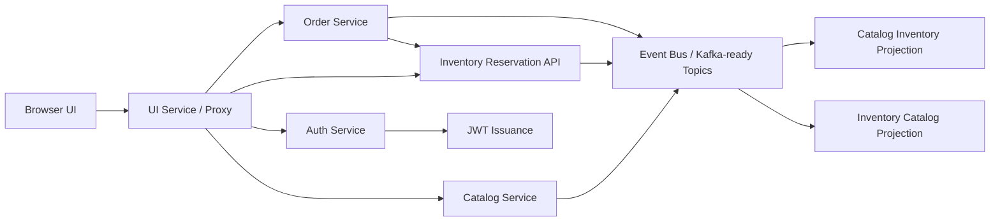

# Mercato

Mercato is a distributed order management system prototype designed around modular services, event-driven synchronization, and secure access controls. It focuses on catalog, inventory, and order workflows, with JWT/RBAC protection and a Kafka-ready event contract boundary.

## Live Demo

[https://mercato-c3gh.onrender.com/](https://mercato-c3gh.onrender.com/)

## Feature Highlights

- Browser-based operations dashboard for catalog, inventory, orders, metrics, and audit logs
- Modular backend services for `auth`, `catalog`, `inventory`, `order`, and the `ui` gateway
- Event-driven synchronization across services using explicit topic contracts
- JWT-based authentication with role-based access control
- Inventory reservation flow tied to order creation
- Local smoke test covering the full product -> stock -> order path
- Dockerized deployment for quick local or hosted demo rollout

## Architecture Overview



## Service Responsibilities

- `UI Service`: serves the frontend and proxies browser requests to backend routes
- `Auth Service`: issues signed JWT tokens with role claims
- `Catalog Service`: manages product creation and updates
- `Inventory Service`: manages stock levels and reservations
- `Order Service`: creates orders and reserves live inventory
- `Event Bus`: delivers service events using Kafka-shaped contracts

## Implemented Flows

1. Generate a JWT token from the UI or API.
2. Create a catalog product.
3. Set inventory for a SKU.
4. Create an order for that SKU.
5. Reserve inventory and reflect updated available/reserved values across the system.
6. Inspect metrics and activity logs from the dashboard.

## Current Tech Shape

- Frontend: plain `HTML`, `CSS`, and `JavaScript`
- Backend: Node.js HTTP services
- Auth: HS256 JWT signing and verification
- Authorization: role-based access control
- Messaging: in-memory event bus with Kafka-ready topic structure
- Deploy: Docker + Render

## Current Constraints

- Data is stored in memory, not in a persistent database
- The event bus is not real Kafka yet; it is a local adapter with Kafka-style topics
- The hosted deployment runs in a single Node process for demo simplicity

## Why It Still Maps Well To A Distributed Design

Even though the current hosted build runs as one process, the code is split by service responsibility and communicates through explicit event and API boundaries. That makes it suitable as a strong distributed systems prototype and a good base for production hardening.

## Roles

- `admin`: full access
- `catalog-manager`: create and update catalog
- `inventory-manager`: update inventory
- `sales-ops`: create orders
- `order-service`: reserve and release stock programmatically

## API Surface

- `POST /api/auth/token`
- `GET /api/catalog/products`
- `POST /api/catalog/products`
- `PUT /api/inventory/stock/:sku`
- `POST /api/orders`
- `GET /api/metrics/catalog`
- `GET /api/metrics/inventory`
- `GET /api/metrics/orders`

## Run Locally

```bash
node src/local-cluster.js
```

The local cluster starts:

- UI: `http://localhost:3000`
- Auth: `http://localhost:4000`
- Catalog: `http://localhost:4001`
- Inventory: `http://localhost:4002`
- Order: `http://localhost:4003`

## Local Validation

```bash
node src/smoke-test.js
```

The smoke test validates:

- UI boot
- token generation
- product creation
- inventory update
- order reservation
- final inventory state after ordering

## Frontend Files

- `ui/index.html`
- `ui/styles.css`
- `ui/app.js`

## Deploy

### Docker

```bash
docker build -t mercato .
docker run -p 3000:3000 -p 4000:4000 -p 4001:4001 -p 4002:4002 -p 4003:4003 mercato
```

### Docker Compose

```bash
docker compose up --build
```

### Render

The project is already deployed on Render using the repo Dockerfile and a single public web service.

## Event Contracts

- `catalog.product.upserted`
- `inventory.stock.changed`
- `inventory.stock.reserved`
- `inventory.stock.released`
- `order.created`
- `order.status.changed`

## Production Upgrade Path

To turn this into a stronger production-grade system:

- add PostgreSQL or another persistent database
- replace the in-memory bus with Kafka or Redpanda
- split services into separately deployable containers
- add tracing, retries, DLQ handling, and structured logging
- add broader automated test coverage
